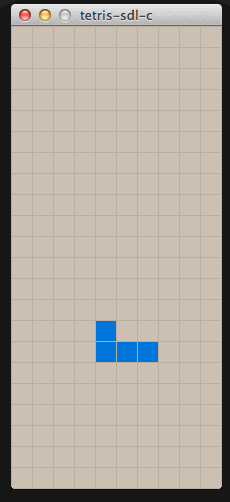

tetris-sdl-c
============

A simple tetris game implemented in C using SDL 2.x.
This is just a toy project to play with and learn SDL 2.x.

**Demo on Snow Leopard OSX:**



**Demo on El Capitan OSX:**

[](https://gfycat.com/gifs/detail/CraftyEntireCleanerwrasse)

Install
=======

1.  Install SDL 2.x ([www.libsdl.org](http://www.libsdl.org/)) in UNIX style; something like `./configure && make && make install`.

    Also you'll need:

    - `sdl2_ttf`: https://www.libsdl.org/projects/SDL_ttf/
    - `sdl2_gfx`: http://cms.ferzkopp.net/index.php/software/13-sdl-gfx

    On OSX (or macOS), you may use [homebrew](http://brew.sh/):

    ```sh
    # As of Dec 2, 2017

    brew install sdl2

    # http://formulae.brew.sh/formula/sdl2_gfx
    brew install sdl2_gfx

    # http://formulae.brew.sh/formula/sdl2_ttf
    brew install sdl2_ttf
    ```

2. `make` to create `tetris_toy`

3. `./tetris_toy`

Usage
=====

- Move tetromino with WASD keys or arrow keys.
- Press `spacebar` for hard Tetromino drop.

- Press `r` to reset.
- Press `esc` to quit.


To Do
=====

- Add wall kick
- Implement any other interesting mechanics listed in http://tetrisconcept.net/wiki/Main_Page

License
=======

MIT.
